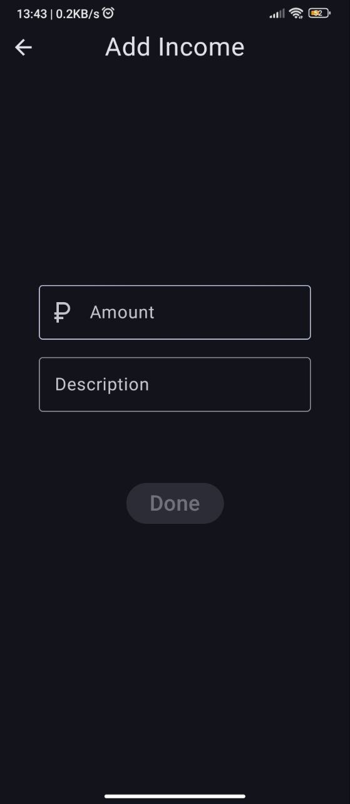

# Finance Tracker
My first education project "Finance tracker" android app
## Screenshots

## TODO
- Fix display of icons on old android versions
- Add sort by date on `All transactions` screen
- Fix bag with number keyboard
- Add video
- Adapt the layout for tablets
